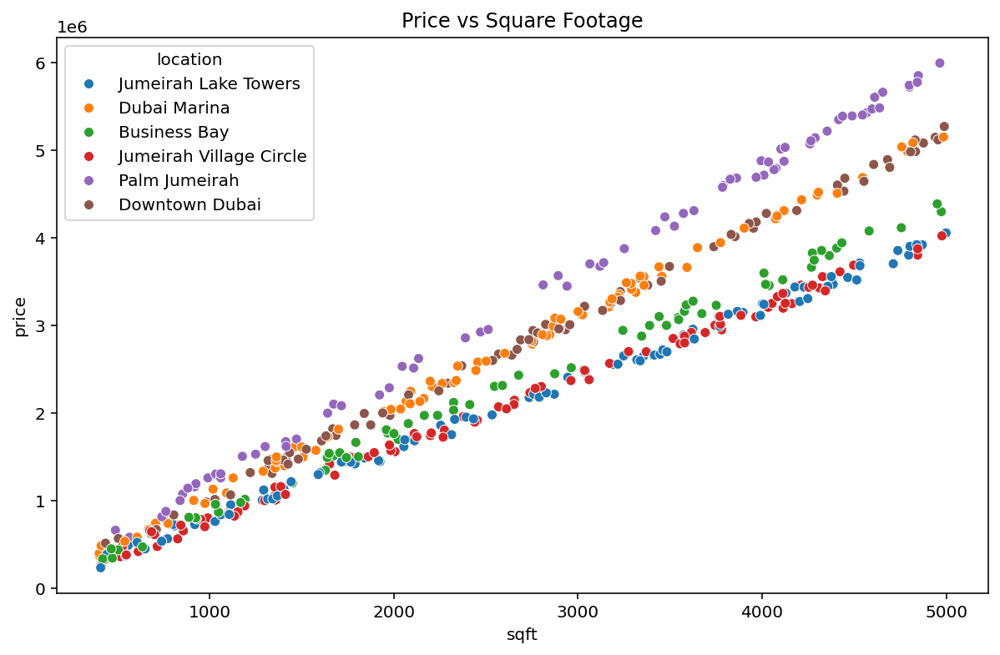
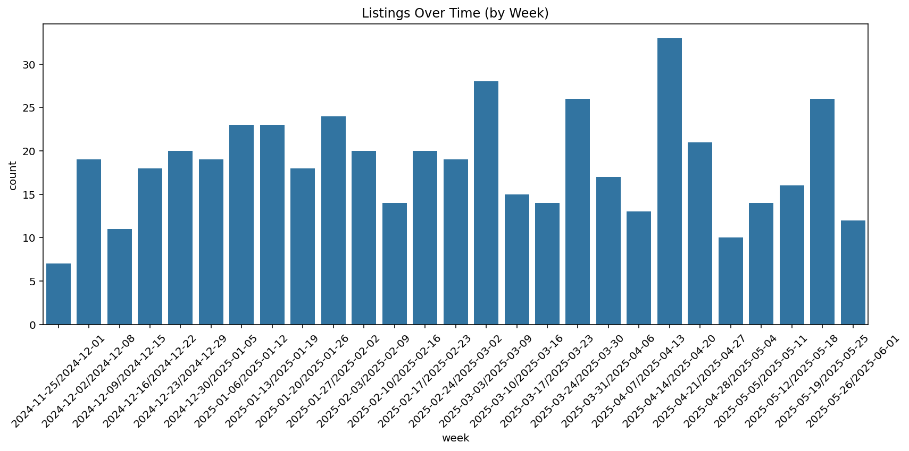
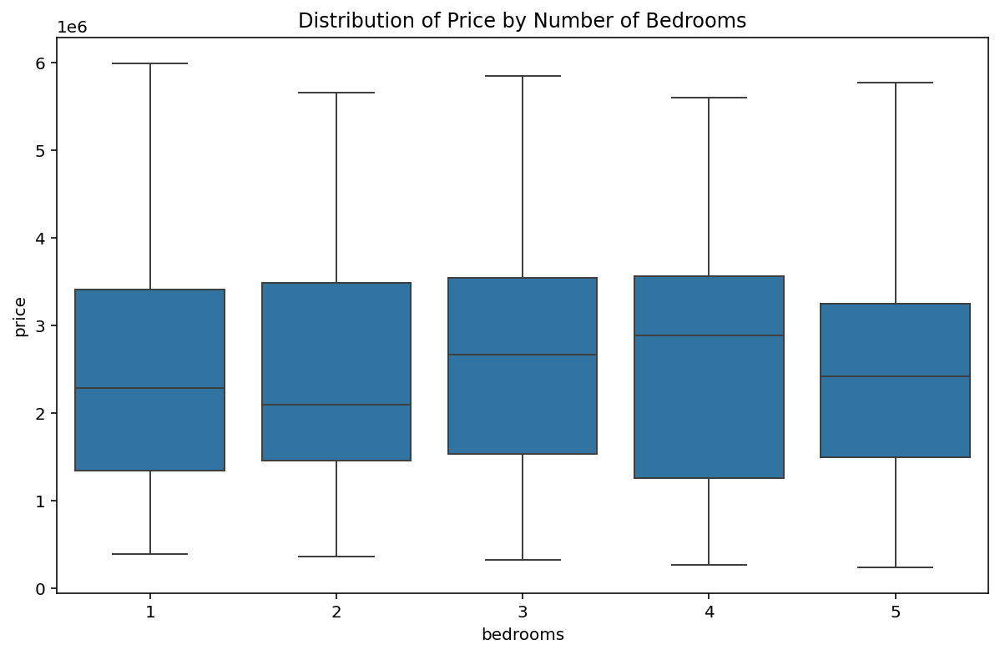

# 🏙️ Simulated Real Estate Dataset & Analysis (Dubai Market)

This project simulates a real estate dataset for Dubai’s residential property market, including locations like **Palm Jumeirah**, **Downtown Dubai**, and **Jumeirah Village Circle**. It is designed to mimic a real API-based property dataset and can be used for **exploratory data analysis (EDA)**, **visualization**, or **Power BI dashboards**.

## 📦 Project Summary

This dataset consists of **500 simulated property listings** generated using Python, covering a wide range of attributes such as:

- Property Type (e.g., Apartment, Villa)
- Location
- Bedrooms and Bathrooms
- Square Footage
- Furnishing Status
- Listing Date
- Agent Assignment
- Listing Status (Available, Sold, Rented)
- Estimated Price (calculated using logic based on size and location)

The project then performs a thorough **EDA** to uncover insights about price trends, location differences, furnishing impact, and more.

---

## 📁 Features

### ✔️ Simulated Data Columns:
- `property_id`: Unique identifier for each listing
- `property_type`: Apartment, Villa, Studio, Townhouse
- `location`: Six major Dubai locations
- `bedrooms`, `bathrooms`: Integer values from 1–5
- `sqft`: Property area in square feet
- `furnished`: Yes/No
- `agent_id`: Simulated agent codes
- `status`: Available / Sold / Rented
- `date_listed`: Random listing dates within the last 180 days
- `price`: Estimated based on location and sqft
- `price_per_sqft`: Derived metric for comparative analysis

---

## 📊 Exploratory Data Analysis (EDA)

We perform several key analyses:

1. **Average Price by Location**
2. **Price vs Square Footage (colored by Location)**
3. **Distribution of Price by Bedrooms (Boxplot)**
4. **Listings Over Time (by Week)**
5. **Price Distribution by Furnishing Status**

---

## 📸 Visualizations

1. 
2. 
3. 
4. 
5. 

---

## 💾 Export to Power BI

The final DataFrame is exported to CSV for further analysis.
